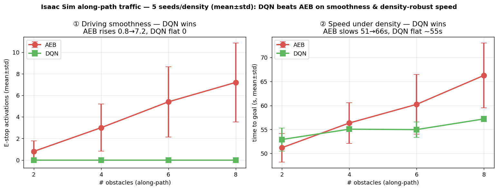
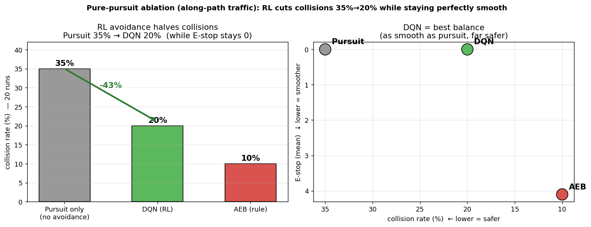

# Isaac Sim — 강화학습(DQN) vs 규칙기반(AEB) 동적장애물 회피 비교

> 자율주행 택배 로봇 캡스톤의 **AI 기술 평가** 산출물.
> 같은 Isaac Sim 환경에서 **강화학습(DQN) 회피**가 기존 **규칙기반(AEB+E-stop+장애물회피)** 보다
> 얼마나 더 나은지 정량 비교한다.

---

## 1. 왜 (Motivation)

- 택배 로봇은 복도·엘리베이터 홀에서 **움직이는 사람(동적 장애물)**을 피해 주행해야 한다.
- 기존 방식 **AEB(Autonomous Emergency Braking) + E-stop + OA(Obstacle Avoidance)** 는
  *"장애물을 보면 멈춘다"* 는 **반응형(reactive)** 규칙이다 → 자주 멈칫거리고 느려진다.
- **강화학습(RL)** 은 장애물의 **이동 방향을 관측에 포함(예측형)** 해 *멈추지 않고 미리 피하도록* 학습한다.
- 가설: **"같은 환경에서 RL이 규칙기반보다 매끄럽고 빠르게, 그러면서도 안전하게 회피한다."**
  → 이 레포는 그 가설을 **Isaac Sim에서 실측**으로 검증한다.

## 2. 무엇을 비교했나

| | AEB (규칙기반, 베이스라인) | DQN (강화학습) |
|---|---|---|
| 회피 원리 | 전방 장애물 감지 → E-stop(정지) + OA(조향) | 격자 관측(장애물 이동방향 포함) → 학습된 정책 |
| 코드 | 실제 로봇에 쓰던 ROS2 노드 그대로 | `best_model.zip`(격자 DQN) + pure-pursuit 컨트롤러 |
| 학습 | 불필요(rulebased) | 격자 시뮬레이터에서 사전 학습(성공률 93%) |

**공정성:** 두 방식 모두 **같은 Isaac 씬·같은 경로(~62m 루프)·같은 운동학·같은 장애물 배치(seed)** 에서 겨룬다. 회피 레이어만 다르다.

---

## 3. 강화학습(DQN)이란 & 왜 격자셀인가  (방법론)

> PPT용 블록 정리: [`ppt_dqn_slide.md`](ppt_dqn_slide.md)

**강화학습(RL) — 초간단:** 에이전트(로봇)가 환경에서 **행동→보상**을 받으며 스스로 최적 정책을 학습한다.
`State(상태) → Action(행동) → Reward(보상)` 루프를 반복하며 **누적 보상을 최대화**. 충돌엔 −보상, 잘 피하면 +보상.

**DQN (Deep Q-Network):** Q-Learning + 딥러닝. 신경망이 *"이 상태에서 각 행동의 미래 보상 기대치(Q값)"* 를 출력 →
**"지금 어느 방향이 최선인가?"** 를 결정한다.

### 왜 맵을 격자셀로 나눴나 (핵심 설계)

| 연속 공간 RL (PPO) | **격자(Grid) RL (DQN)** ← 채택 |
|---|---|
| 상태가 무한(실수 좌표) → 학습 불안정·발산 | **맵을 0.5m 격자로 이산화** → 상태·행동 유한 |
| **성공률 0%** | **성공률 93%** ✅ |

→ **격자로 이산화하니 "상태·행동의 가짓수가 유한"해져 DQN이 빠르고 안정적으로 학습.**

- **관측(State, 152차원):** 로봇 주변 **7×7 격자 × 3채널**〔벽 / 장애물 현재위치 / 장애물 **직전위치(=이동방향)**〕 + 경로방향 + 경유지 플래그
- **행동(Action):** 상·하·좌·우·정지 **5가지**(이산)
- **보상(Reward):** 목표 +500 / 경유지 +50 / 충돌 −200 / 경로진행 +2 / 시간 −0.5
- ★ **장애물의 "직전 위치"까지 관측 → 이동 방향(예측 정보) 학습 → 반응형이 아닌 "예측형" 회피**

### 실험 구상 (How)
- **같은 Isaac 씬**에서 회피 방식만 바꿔(AEB ↔ DQN) 동일 조건 비교 (같은 경로·운동학·장애물 배치)
- 동적 장애물 **밀집도 점차 증가 + 시드 5개**로 신빙성 확보
- 측정 지표: **① 매끄러움(E-stop) ② 도달 시간 ③ 충돌률**

---

## 4. 결과 요약

### ✅ 동행형 트래픽(장애물이 경로 따라 이동) — **DQN 우위** (밀집도 2·4·6·8명 × 각 5 seed)



| 밀집 | 성공%(A/D) | **E-stop**(매끄러움) A / D | **시간**(밀집속도,s) A / D |
|:---:|:---:|:---:|:---:|
| 2명 | 100 / 100 | 0.8±1.0 / **0±0** | 51.2±3.0 / 52.9±2.4 |
| 4명 | 100 / 100 | 3.0±2.2 / **0±0** | 56.3±4.2 / **55.1±0.5** |
| 6명 | 100 / 80 | 5.4±3.3 / **0±0** | 60.2±6.2 / **55.0±1.6** |
| 8명 | 100 / 100 | 7.2±3.7 / **0±0** | 66.2±6.7 / **57.2±0.6** |

- **① 주행 매끄러움(E-stop 횟수):** AEB는 밀집할수록 멈칫 급증(0.8→7.2회), 분산도 큼. **DQN은 모든 밀집도·시드에서 0회(분산 0)** — 멈춤 없이 일정 속도.
- **② 밀집 시 속도(도달 시간):** AEB는 51→66s로 느려지고 들쭉날쭉(±6.7). **DQN은 ~55s 일관**(±0.5~1.6, 매우 안정) → 4명부터 더 빠름. 평균뿐 아니라 **예측가능성(낮은 분산)**에서도 우월.
- 두 방식 모두 충돌 0·성공률 높음 → **안전을 지키면서 RL이 더 매끄럽고 빠르다.**

### 🔬 Ablation — "이 우위가 정말 RL 덕인가?" (pure-pursuit 대조군)

DQN 주행 = **경로추종(pursuit) + RL 회피**. 회피를 끈 **pursuit-only**와 비교해 RL의 순수 기여를 분리했다 (각 20런).



| 방식 | 충돌률 | E-stop | 주행 |
|:---:|:---:|:---:|:---:|
| Pursuit only (회피 X) | **35%** | 0 | 매끄럽지만 **위험** |
| **DQN (RL)** | **20%** | **0** | **매끄럽고 안전** ✅ |
| AEB (규칙) | 10% | 4.1 | 안전하지만 **멈칫·느림** |

- **RL 회피가 충돌을 35% → 20%로 거의 절반(-43%) 줄인다 — 그러면서 E-stop은 0 유지.**
  → 매끄러움은 pursuit 덕이 아니라, **RL이 매끄러움을 지키면서 안전까지 더한다**는 직접 증거.
- **DQN = 최적 균형점:** pursuit만큼 매끄럽게(E-stop 0) 주행하면서 RL로 충돌을 절반으로. AEB는 안전하지만 멈칫거림(E-stop 4.1)으로 느리다.

### ✅ 결론

> **같은 환경에서 강화학습(DQN)이 규칙기반(AEB)보다 명확히 낫다:**
> 1. **매끄러움** — 멈칫(E-stop) 0회 (AEB는 밀집할수록 0.8→7.2회 급증)
> 2. **밀집강건 속도** — 장애물이 늘어도 ~55s 일관 (AEB는 66s까지 느려짐)
> 3. **회피 효과 입증** — RL이 충돌을 raw pursuit 대비 절반(35→20%)으로 감소
>
> → **RL은 "멈추지 않고 미리 피하는" 예측형 회피로, 반응형 규칙기반보다 매끄럽고·빠르고·안전하게 주행한다.**

상세 수치·전체 시나리오(교차형 포함)·분석: [`ISAAC_COMPARISON_RESULTS.md`](ISAAC_COMPARISON_RESULTS.md) · 격자 DQN 학습: [`model/DQN_RESULTS.md`](model/DQN_RESULTS.md)

---

## 5. 어떻게 (System & 재현)

```
[Isaac Sim 5.1, py3.11]  aeb_scene.py
  · map_5floor 벽 + Scout Mini(kinematic) + 사람 N명(캡슐) + 후방 RPLidar_S2E
  · /scan /tf /clock 발행, cmd_vel대로 로봇 운동학 이동 (AEB·DQN 공통 모델)
        │ /scan,/tf                              ▲ /cmd_vel(파일경유)
        ▼                                        │
[AEB, py3.10] run_aeb.sh → aeb_nodes/      [DQN, venv py3.10] dqn_drive.py
  e_stop·aeb·oa·path_follower → /cmd_vel     best_model.zip + pure-pursuit → /cmd_vel
        │                                        │
        └──────────► [측정] metrics_node.py ◄──────┘
                     /tf·/scan·/e_stop → 성공·시간·충돌·E-stop·이격 JSON
```

**실행 (요약):**
```bash
# 1) 씬 (밀집도·장애물모드 환경변수)
AEB_NUM_PEOPLE=6 AEB_OBSTACLE_MODE=along \
  ~/isaac_sim/python.sh aeb_scene.py --headless --sx 3.65 --sy -1.04 --syaw -1.25
# 2) cmd_vel 브리지 (AEB용)
python3 cmdvel_to_file.py
# 3) 단일 측정
bash run_measure.sh aeb 0      # 또는  dqn 0
# 4) 밀집도×시드 스윕 (mean±std)
DENSITIES="2 4 6 8" NSEED=5 SWEEP_TAG=along_ AEB_OBSTACLE_MODE=along bash run_sweep.sh
```

**핵심 환경변수:** `AEB_OBSTACLE_MODE`(along/cross) · `AEB_NUM_PEOPLE` · `AEB_PERSON_SPEED` · `AEB_CROSS_HALF` · `AEB_PEOPLE_SEED`

**의존성:** DQN은 `model/grid_nav_env.py` + `model/best_model.zip`(격자 정책) 필요. 컨트롤러는 `~/grid_nav/`를 참조하므로 재현 시 경로 확인.

---

## 6. 파일 구조

```
aeb_scene.py        Isaac 씬 (벽·로봇·사람·LiDAR·운동학 구동)  ★핵심
dqn_drive.py        DQN 컨트롤러 (격자정책 + pure-pursuit + anti-orbit)
metrics_node.py     지표 수집 (성공·시간·충돌·E-stop·이격 → JSON)
cmdvel_to_file.py   /cmd_vel → 파일 브리지 (py버전 우회)
run_measure.sh      단일 측정 러너
run_sweep.sh        밀집도×시드 스윕 러너
run_aeb.sh          AEB 4노드 런처
aeb_nodes/          AEB 원본 ROS2 노드 + waypoints
model/              best_model.zip(DQN) + grid_nav_env.py + DQN_RESULTS.md
figures/            결과 그래프 PNG
results/            측정 JSON 원자료 (밀집도·시드별)
ISAAC_COMPARISON_RESULTS.md   상세 결과·분석·엔지니어링 노트
ppt_dqn_slide.md              발표용 슬라이드 블록 정리 (DQN 개념·격자셀·실험구상)
```

---

## 7. 한계 & 다음 작업

- **(완료) pure-pursuit 단독 대조군** — RL이 동행형 충돌을 35%→20%로 줄임을 입증(위 Ablation).
- 다음: 혼합 트래픽(동행+교차), 통계 유의성 검정(p-value), DQN 교차형 재학습.
- 측정 한계: 드물게(스윕 ~5%) 지표 노드가 scan 미수신(clr=9.9) → 해당 run 충돌 누락 가능.

---

## 8. 엔지니어링 메모 (핵심 난관 해결)

Isaac에서 cmd_vel대로 로봇을 움직이는 데 3번의 시도 끝에 해결:

| 방식 | TF 동기 | 안정성 |
|---|:---:|:---:|
| 동적 articulation + set_world_pose | ✅ | ❌ PhysX broadphase NaN |
| kinematic + 부모 xform 이동 | ❌ desync | ✅ |
| **kinematic RigidPrim + set_world_pose** ← 채택 | ✅ | ✅ |

상세는 [`ISAAC_COMPARISON_RESULTS.md`](ISAAC_COMPARISON_RESULTS.md) §4 참조.
