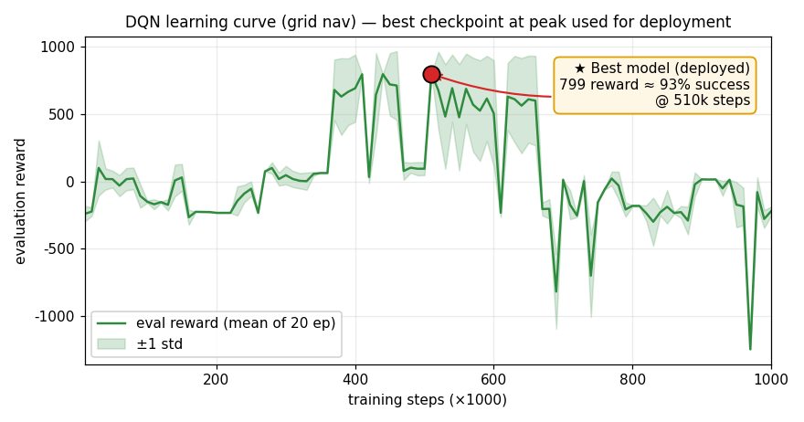
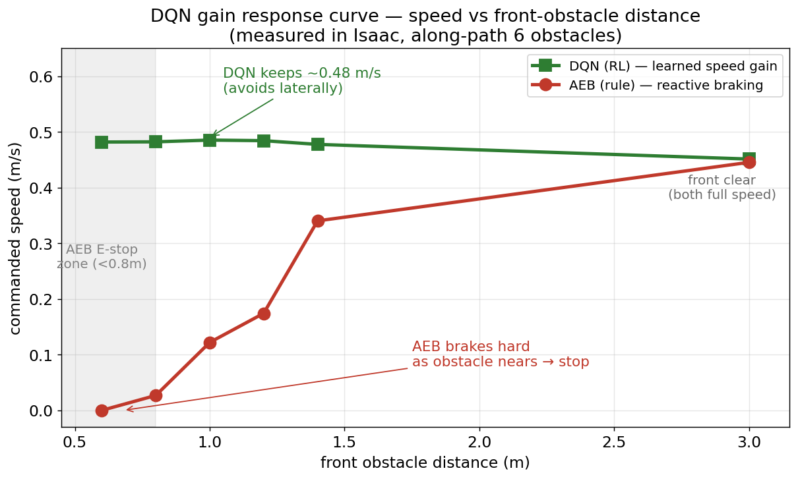

# 🔧 DQN 게인 추출 → 실제 AEB 파라미터로 이식

> **RL이 학습한 회피 거동을 분석해, 규칙기반 AEB 컨트롤러의 게인으로 이식한다.**
> *"멈추는 대신 미리 옆으로 조향" — DQN의 강점을 실제 AEB에 옮긴다.*

---

## 🔁 전체 흐름

> 도출한 게인 세트를 **실제 AEB 컨트롤러에 적용한다.** *(적용 결과 주행은 데모 영상으로)*

---

## ❓ 왜 신경망(DQN)을 그대로 안 쓰고, 게인만 뽑았나?

> **RL은 "좋은 회피 거동을 찾는 탐색 도구"로 쓰고, 배포는 안전·해석 가능한 규칙기반 제어기로 한다.**
> — 학습 정책을 *reference(oracle)* 삼아 게인을 도출하는 방식은 실제 현장에서 널리 쓰는 패러다임.

| | 신경망 정책 직접 탑재 | **게인 이식 (채택)** |
|---|---|---|
| 🔍 **해석 가능성** | 블랙박스, 왜 그렇게 움직이는지 불명 | 게인을 사람이 읽고 이해·수정 가능 |
| 🛡️ **안전·검증** | 최악 케이스 보장 어려움 | 규칙기반 E-stop → 동작 보장·검증 쉬움 |
| ⚙️ **배포 비용** | 실차에서 GPU 추론 필요 | 가벼운 조건문/룩업으로 동작, HW 부담 ↓ |
| 📈 **안정성** | 학습 분포 밖에서 폭주 가능 | 게인 기반은 거동 예측 가능 |

> 관련 패러다임: **RL 기반 제어기 튜닝 · 정책 증류(policy distillation) · residual RL · sim-to-real (규칙기반 fallback)**

---

## ① 근거 — DQN 학습 & 게인 반응곡선

| ① DQN 학습 (best 모델) | ② 게인 반응곡선 (Isaac 실측) |
|:---:|:---:|
|  |  |
| 최고 평가보상 **799 ≈ 성공률 93%** @510k 스텝 → best 체크포인트 | 🟢 **DQN: ~0.48 m/s 일정** vs 🔴 **AEB: 급제동→0.8m 정지** |

> 곡선에서 직접 읽은 게인 → **순항 0.48 m/s · 유지 이격 ≈ 1.0 m · 전방 ~3m 조기 회피**

---

## ② 이식한 게인 (원본 → DQN 기반)

**논리: E-stop(브레이크)은 줄이고, OA(조향)는 키우고·앞당긴다.**

| 레이어 | 파라미터 | 원본 | DQN 기반 | 방향 | 의미 |
|:---:|:---|:---:|:---:|:---:|:---|
| 순항 | `linear_speed` | 0.5 | **0.48** | → | plateau 직접 이식 |
| **OA** | `x_max` (전방감지) | 1.5 | **2.5** | ⬆️ | 더 **멀리** — 미리 조향 시작 |
| **OA** | `y_half` (측면폭) | 0.45 | **0.6** | ⬆️ | 더 **넓게** — 1.0m 이격 확보 |
| **OA** | `oa_max_omega` (조향) | 0.5 | **0.9** | ⬆️ | 더 **세게** — 멈춤 대신 틀어 회피 |
| **E-stop** | `front_max_x` (정지거리) | 0.8 | **0.4** | ⬇️ | 정지박스 **축소** — 위급할 때만 |
| E-stop | `front_min_x` / `side_y` | 0.2 / 0.25 | **유지** | 🔒 | 안전 최소값 보존 |

> **OA = 멀리(1.5→2.5) · 세게(0.5→0.9) · 넓게(0.45→0.6)  /  E-stop = 정지박스 축소(0.8→0.4m)**

---

## 💬 한 줄 메시지

> **"sim에서 학습한 RL의 회피 거동을, 실제 규칙기반 AEB의 게인으로 이식해 적용한다."**
>
> → 적용 결과 주행은 **데모 영상**으로 확인.

※ 직접 측정값=순항 0.48·이격 1.0m, 나머지 게인은 DQN 거동에서 추론. ※ E-stop 안전 최소값(front_min 0.2 / side 0.25)은 보존.

*근거: `figures/dqn_score_curve.png` · `figures/dqn_gain_response_curve.png` · 게인 `DQN_GAIN_TO_AEB.md`*
